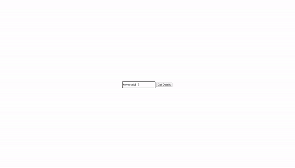

# Product Catogorizer

clone the repo 

    git clone https://github.com/Thilak135/product_catogorizer.git

 create a virtual environment
 
    python3 -m venv venv

activate virtual envirnoment

    venv/Scripts/activate     # For windows
     venv/bin/activate       # For Mac/Linux

install requirements

    pip install requirements.txt

Edit your rename .env.example to .env

        ren .env.example .env   # for windows
        mv .env.example .env    # For linux/Mac

Create embeddeds to store in chroma DB

    python ingest.py

run application by typing

    python main.py

the application runs in <a href="http://localhost:10000/">Home Page</a>

### Approach

1)  Imported the necessary libraries 
    -pandas
    -json
    -requests
    -Chroma dB

2)  Loaded the taxonomy data and converted into a pandas data frame for better visibility and understanding of the data

	-Taxonomy Represents Fixed Categories: The taxonomy defines categories and attributes for product types. Filling NaN might introduce inconsistencies or create new categories that aren't intended.
	-Missing Values Might Indicate Intent: If a specific attribute is marked as "M" (mandatory) but has a NaN value, it might signify that the attribute doesn't apply to that sub-category. Filling with a value (mean, median, or mode) could mask this valuable information.
    
3)  Tried to create embeddings for sub category alone and then map the documents with the subcategory.so the query can be embedded into embeddings and do similarity search and then from that we can get sub category then using that, retrieving other information 

4)  Then went to the blog https://dev.to/peterabel/using-vector-databasespinecone-with-datajsontabular-2ik9 and thought to create embeddings for the entire list separately instead of creating embeddings only for sub category

5)  Loaded json file directly (didn't convert to data frames)

6)  Went to documentation of chroma https://docs.trychroma.com/usage-guide#creating-inspecting-and-deleting-collections 
were i got idea to create vector embeddings for subcategory alone and store it in the vector database along with the meta data where the meta data consists of all the attributes mapped with the subcategory embeddings  

7)  Created a variable named documents and stored the subcategory's value alone as a list 

8)  Removed the items which had "O" as value and created index for those items with value "M"

9)  Created a function to create embeddings and added those embeddings to a list named embeddings

10) Created a function to store the created embedding with the meta data. here we created a collection with the collections path and with metadata of the collection were we gave cosine as the dict value 

11) Added the created embeddings and the meta data to the created collection named vector stores

12) Created functions to retrieve the query and create query embeddings 

13) Created a function to retrieve the top similar embeddings and  metadata from the vector store using get. Collection() method  

14) Got the "api-key" of Gemini-model and store it in the .env folder 

15) Used the Gemini model api-key and initiated the llm model

16) Query and the list of subcategory from retrieved top embeddings and its metadata's documents is then passed to the llm to give the best similar value from the list

17) Then the value is searched from the metadata and the dictionary with the metadata value which is equal to llm's output value is given as output to the user

18) Implemented oops concepts and created instance in order to load the model only once

### working video

